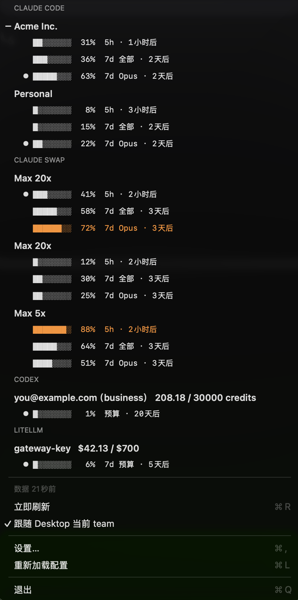

<p align="center">
  
</p>

# AI Usage Bar

[English](README.md) | **中文**

**你的所有 AI 订阅额度，抬头一眼就能看到。**

订阅了 Claude Code、Codex，公司还发了个网关 key —— 每个额度都要跑去不同的地方查，快用完了也没人提醒你。AI Usage Bar 把它们全部收进 macOS 菜单栏：菜单栏常驻一个百分比，点开看全部明细，快到上限时主动弹通知。

<p align="center">
  
</p>

## 能做什么

- **一处看全**：Claude Code（多个 team）、Claude Swap（cswap）的全部槽位账号、Codex、自建 LiteLLM 网关，一个菜单全覆盖
- **跟随 Claude Desktop**：菜单栏数字自动跟随 Desktop / Claude Code 当前登录的 team，切 team 秒级跟随；也可以手动固定住任意账号
- **兼容 cswap**：装了 [claude-swap](https://github.com/realiti4/claude-swap)（cswap）的用户零配置 —— 直接读它的用量缓存，所有槽位账号自动出现在菜单里，当前切到的槽位带「在用」标记；只读，不碰它的凭证
- **额度告警**：正在用的账号快到上限时发系统通知，不用等到 100% 才发现
- **永远知道数据多新**：每份数据都标注「多久之前取的」，超过 10 分钟标「已过期」—— 宁可让你看见「3 分钟前」，也不假装实时
- **中英双语**：界面默认跟随系统语言，也可在设置里强制指定
- **无遥测**：不上传任何东西，只跟各家厂商自己的接口通信，全部代码 1000 行出头，自己就能审计

## 安装

需要 macOS 13+ 和 Swift 6（Command Line Tools 自带即可，**不需要完整 Xcode**）。

```bash
./scripts/bundle.sh && cp -R "build/AI Usage Bar.app" ~/Applications/
```

也可以直接下 [Releases](../../releases) 里打包好的 `.app`。

开机自启：系统设置 → 通用 → 登录项。

## 配置

菜单 → **设置…**（⌘,）打开配置面板：来源开关、LiteLLM 网关地址与 API Key、轮询间隔、菜单栏前缀、界面语言，以及**一键添加 Claude team**。保存立刻生效，不用重启。

面板背后就是 `~/.config/ai-usage-bar/config.json`（尊重 `XDG_CONFIG_HOME`；首次运行自动生成，权限 `0600`），喜欢手改 JSON 依然可以，改完点 **重新加载配置**（⌘L）生效：

```json
{
  "pollMinutes": 60,
  "menuBarPrefix": "AI",
  "language": "auto",
  "providers": {
    "claude-code": { "enabled": true },
    "claude-swap": { "enabled": true },
    "codex":       { "enabled": true },
    "litellm":     { "enabled": false, "baseURL": "", "apiKey": "" }
  }
}
```

不想看的来源把 `enabled` 改成 `false`，那一组会整个消失（连刷新都不会跑）。`language` 支持 `auto`（跟随系统）/ `zh` / `en`。`pollMinutes` 下限 5 分钟 —— 原因见下方「两个设计取舍」。

## 各来源怎么工作

### Claude Code

读各配置目录里的 `.claude.json`（`cachedUsageUtilization`），**不碰任何凭证**。刷新靠 `claude -p "/usage" --safe-mode` —— 无头模式能跑斜杠命令，向服务端取实时额度并写回缓存，**不过模型、不花钱**（返回里 `total_cost_usd: 0`、`num_turns: 0`）。

**看多个 team**：同一个账号下的多个 team 需要各自一份登录态，靠多个配置目录实现。**推荐走面板**：设置 → **添加 Claude team…**，起个短名 → 自动建目录并打开终端 → 你在终端里正常登录（选对应的 team）→ 登录完成后自动出现在菜单里。

手动做等价于：

```bash
mkdir -p ~/.claude-work ~/.claude-personal
CLAUDE_CONFIG_DIR=~/.claude-work claude       # 登录时选 team A
CLAUDE_CONFIG_DIR=~/.claude-personal claude   # 登录时选 team B
```

本程序自动发现 `~/.claude` 和所有 `~/.claude-*`。每个 team 登录一次是 Claude Code 凭证模型决定的（一份登录态只属于一个 org），绕不开。

> ⚠️ **别把 `CLAUDE_CONFIG_DIR` export 进 shell 配置** —— 那会让你所有的 `claude` 都搬家，历史、settings、MCP、plugins 全都读不到。用 alias：
> ```bash
> alias claude-work='CLAUDE_CONFIG_DIR=$HOME/.claude-work claude'
> ```

### Claude Swap（cswap）

用 [claude-swap](https://github.com/realiti4/claude-swap) 管理多个 Claude 账号的话，**什么都不用配**：本程序直接读它的产物（`~/.claude-swap-backup/` 下的用量缓存和配置备份），所有槽位账号自动出现在菜单里，当前切到的槽位标「在用」。

只读、不碰它的凭证与状态；刷新节奏由 claude-swap 自己控制（默认约 10 分钟一轮），所以这组没有「立即刷新」—— 菜单会如实标注数据年龄。没装 cswap 这一组不会出现。

### Codex

`GET https://chatgpt.com/backend-api/wham/usage`，用 `~/.codex/auth.json` 里的 OAuth token 认证 —— 和 Codex CLI 自己用的是同一个凭证、同一个口。

> ⚠️ **未公开接口**，OpenAI 随时可能改。影响范围限于 `CodexProvider.swift`。

**额度长在哪取决于计划类型**，这是最容易踩的坑：

| 计划 | 额度字段 |
|---|---|
| 个人版（Plus / Pro） | `rate_limit.primary` / `.secondary` 百分比窗口 |
| business / team | `spend_control.individual_limit` 的 **credits** 额度（不是美元；此时 `rate_limit` 是 `null`） |

本地 session rollout（`~/.codex/sessions/**/rollout-*.jsonl`）**只记 `rate_limits`**，所以在 business 计划下翻本地文件会得出「没有额度数据」的错误结论。必须打接口。

token 过期时（401）会自动跑一次 `codex doctor` —— 它用 refresh_token 换新 token 并写回 `auth.json`，走官方流程，不动你的登录态。

### LiteLLM 网关

[LiteLLM](https://github.com/BerriAI/litellm) 是常见的自建 AI 网关：团队用它统一代理各家模型、按 key 发额度、集中记账。如果你们公司给你发了一个 `sk-` 开头的网关 key 和一个内网地址，多半就是它。

`GET {baseURL}/key/info` 返回这个 key 的 `spend` / `max_budget` / `budget_duration` / `budget_reset_at` —— 也就是「这个周期你花了多少、上限多少、什么时候重置」。这是 LiteLLM 自己的公开接口，不是私有口，所以这条最稳。

配置来源按优先级：配置文件 → 环境变量 `LITELLM_BASE_URL` / `LITELLM_API_KEY` → shell 配置里的对应 `export`。

最后一条不是偷懒 —— 从 Finder 启动的 `.app` **拿不到 shell 环境变量**，不兜这一层就等于没配。

## 隐私与安全

这个工具会碰到你的凭证，所以把边界写清楚，方便自己审计（全部代码 1000 行出头）。

**读什么**

| 文件 | 内容 | 用途 |
|---|---|---|
| `~/.claude.json`、`~/.claude*/.claude.json` | 用量缓存与账号元信息，**不含凭证** | 展示 Claude Code 额度 |
| `~/.claude-swap-backup/cache/usage.json` 等 | claude-swap 自己轮询到的各槽位用量与 org 元信息，**只读** | 展示 cswap 账号额度 |
| `~/Library/Application Support/Claude/Local Storage/leveldb/*.log` | 只正则抓 `lastOrganization` 的 org uuid，其余字节不解析不存储 | 「跟随 Desktop 当前 team」的实时信号 |
| `~/.codex/auth.json` | **含 OAuth access token** | 仅用作请求 ChatGPT 的 `Authorization` 头 |
| `~/.config/ai-usage-bar/config.json` | 你填的 LiteLLM 地址与 key | 请求你自己的网关 |
| shell 配置（如 `~/.zshrc`） | 只匹配 `LITELLM_BASE_URL` / `LITELLM_API_KEY` 两行 | 配置回退 |

**发到哪**

- `https://chatgpt.com/backend-api/wham/usage` —— 带 Codex token（和 Codex CLI 自己发的是同一个请求）
- `{你配置的 baseURL}/key/info` —— 带你的网关 key，只发到你自己的网关

**没有第三方、没有遥测、没有分析。** 除上面两个地址外不发任何网络请求。

**跑什么子进程**

- `claude -p "/usage" --safe-mode --output-format json` —— 取 Claude Code 额度
- `zsh -lc "codex doctor"` —— **仅在 Codex 返回 401 时**，用官方命令刷新过期 token

**写什么**

- `~/.cache/ai-usage-bar/*.json` —— 只落用得上的用量数字，**不含任何 token**
- `~/.config/ai-usage-bar/config.json` —— 首次运行生成模板，权限 `0600`；已存在但权限过松时启动会收紧

**不做的事**：不读浏览器数据、不上传任何东西、不改你的登录态（`codex doctor` 走官方刷新流程，和你自己敲一遍完全一样）。

## 两个设计取舍

**1. 刷新有下限。** Claude Code 的 `/usage` 大约 5 分钟才真的重新取数，窗口内重复调用服务端沿用旧数据，**而且命令退出码仍然是 0**。所以程序比对刷新前后的时间戳，只有真往前走了才算更新；后台轮询默认 60 分钟只是兜底 —— 点开菜单时数据超过 5 分钟会自动刷新，看到的总是新的；手动把 pollMinutes 调密也不会低于 5。

**2. 永远显示数据年龄。** 这是快照不是实时流，超过 10 分钟标「已过期」。宁可让你看见「3 分钟前」，也不假装实时。

## 加一个新来源

数据获取全在 `UsageProvider` 协议后面，UI 只认 `Account`：

```swift
struct FooProvider: UsageProvider {
    let id = "foo"
    let displayName = "Foo"
    func readAccounts() -> [Account] { ... }                    // 读本地缓存，不发请求
    func refresh(_ account: Account) -> RefreshResult { ... }    // 同步阻塞，调度层负责并发
}
```

然后注册进 `Provider.swift` 的 `registered` 数组。菜单栏标题、分组展示、并行刷新、数据年龄标注都不用改。

被动推送型的来源可以在 `refresh` 里返回 `.notSupported`，UI 会如实标出来而不是假装刷新过。

## 调试

```bash
swift run AIUsageBar --dump              # 不起 UI，只读本地
swift run AIUsageBar --dump --refresh    # 先刷新再打印
```

截图 / 测试可以用 `AI_USAGE_BAR_HOME=<目录>` 把所有本地读取整体重定向到一个假家目录，
再配 `AI_USAGE_BAR_DEMO=1` 禁掉全部网络刷新，喂假数据跑 UI。

## 已知限制

- Claude Code 的默认目录 `~/.claude` 会跟着你在界面里切 team 而变。它和某个专用目录指向同一个 team 时会被自动隐藏 —— 专用目录才是稳定的那份。
- 只覆盖订阅制额度。API 计费账号（Anthropic Console / OpenAI Platform）是另一套，不在这里。
- 没被刷新过的来源显示「还没取过」，点一次「立即刷新」即可。

## 反馈

用出问题、有想支持的新来源、或者任何建议 —— 欢迎开
[Issue](https://github.com/popring/ai-usage-bar/issues)。附上 `swift run AIUsageBar --dump` 的输出（记得抹掉邮箱等敏感信息）能让问题定位快很多。

觉得好用的话，顺手点个 ⭐ **Star** —— 这是让这个项目继续迭代的最好方式。

## License

MIT
